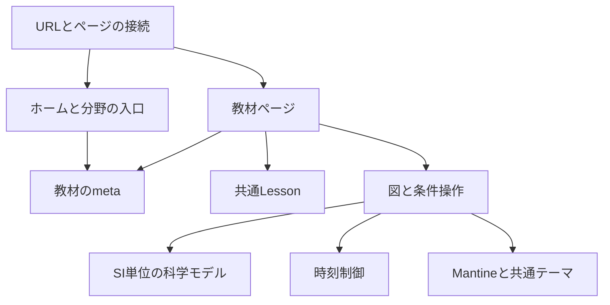

# science-studyのアーキテクチャ

## システムの構成

science-studyは、一つのリポジトリとパッケージで管理するReactの単一SPAである。
Viteがアセットをビルドし、TanStack RouterがURLとページを接続する。
ブラウザ内で科学モデルを計算し、現在の教材はSVGへ描画する。
現在はバックエンド、認証、個人の記録を保存する仕組みを持たない。

この文書は構成、責務境界、依存方向と設計判断を扱う。
開発者の実装規約と作業手順は[開発ガイド](development.md)、教材の目的と範囲は[教材方針](project-design.md)に置く。
教材固有の式、操作条件、場面と状態は、各教材の `lesson.md` が管理する。

## レイヤーと依存方向

教材はページから表示部品とモデルを組み立てる。
表示部品はモデルの計算結果を受け取り、画面上の座標へ変換する。
モデルが表示部品を参照しないことで、画面幅や描画方式を変えても計算の単位と前提を保てる。

矢印は、呼び出しまたは参照の方向を表す。
`model.ts` はReact、DOM、p5、画面のピクセル値を参照しない。
`lesson.md` は制作者の記録であり、ブラウザへ読み込むデータではない。

| 境界 | 担当すること | 別の層へ渡すこと |
| --- | --- | --- |
| `routes/` | URLとページの接続 | 科学の計算は教材側へ渡す |
| `app/` | ホーム、分野の入口、ナビゲーションとテーマ | 個別の実験状態は教材へ渡す |
| 教材ページと `meta.ts` | 本文、図、条件操作の組み立てと入口の案内 | 描画ループと計算は専用部品へ渡す |
| `model.ts` | 条件と時刻から観察量を計算 | ピクセルへの変換は表示側へ渡す |
| 図と `simulation.tsx` | 操作状態、比較対象、座標変換と描画 | 物理法則はモデルへ渡す |
| 時刻制御 | 再生、停止と時刻指定 | 位置や速度はモデルで求める |

力学の `shared/daily-motion.tsx` は歩く人と車の道、同じ条件のグラフ、時刻操作を担当する。
各教材は自身のSIモデルを渡し、人や車の姿は描画側だけで模式表示にする。
`use-experiment-clock.ts` は時刻指定、手動再生と、非表示、離脱、動きを減らす設定での停止を扱う。
光学の各題材は `concept-experiences.tsx` から表示部品を組み立て、旧フォルダのSIモデルと光路描画を共用する。
`app/lesson-catalog.ts` は全九教材のmetaと前提を参照し、ホームと力学の目次へ渡す。
`app/optics-lessons.ts` は光学七教材の順序と前提を管理する。
従来のp5描画、独立した説明アニメーションと一般条件のUIは現在の学習ルートへ接続しない。
複数の教材で同じ責務が必要になった段階で共通化する。

## 教材と共通Lessonの契約

共通Lessonは、入口、図と条件の比較、任意の式と前提、参考資料を配置する。
全教材の観察、操作、説明を同じ節に置き、独立した条件探索の節を持たない。
`LessonContent` は行為、理解する関係、説明範囲、中心の問いと接続先を保持し、ホームと分野のカードも同じ `meta.ts` を参照する。
教材ページは同じ題材の観察から説明までを `mechanism` へ渡す。
共通Lessonはmetaから一つのゴールと場面、範囲を表示し、末尾の案内は各教材から受け取る。
表示項目と設計記録の対応は[教材方針](project-design.md#表示と設計記録の対応)に定める。

同じ条件を使う観察と説明は、その条件を教材ごとの親部品に置いて共有する。
ストローでは水の有無、鏡の葉では距離、虫めがねの葉では距離とレンズの有無が共有状態である。
別の条件を使う補助図は独立した状態を持ち、その違いを画面で明示する。
条件を表示部品へ重複して持たせないことで、操作、図と説明の不一致を防ぐ。

## 計算と描画の時間

現在の運動モデルは解析式を評価し、数値積分の時間刻みを持たない。
時刻制御はrequestAnimationFrameのタイムスタンプ差で進み、描画回数から物理時刻を計算しない。
物理時刻と作図の説明時間は別の状態として管理する。
物体の座標はモデルの結果を使い、演出用のイージングで運動を変えない。

描画部品は、時刻制御が選んだ状態だけを画面へ出す。
SVGはReactの更新で描画し、表示幅に合わせて拡縮する。
モデルへ画面の大きさを渡さない。
比較する図には共通の縮尺を使い、条件変更で縮尺も変わる場合は図の近くに示す。

描画部品は、離脱時にフレームとイベントリスナーを解除する。
非表示や動きを減らす設定では再生を停止し、静止場面と時刻指定で図をたどれる状態を保つ。
React StrictModeの再マウントでも、離脱した部品の処理を残さない。
教材ごとの終了時刻、初期化、状態保持と破棄の条件は各教材の `lesson.md` に置く。

## 表示基盤を選ぶ理由

共通の操作部品とテーマはMantineが担い、科学の状態はReactの部品とフックが担う。
`main.tsx` が標準CSSとMantineProviderを読み込み、`app/theme.ts` が色、文字と角丸を定める。
標準部品を使うことで、操作の外観とアクセシビリティを教材ごとに再定義せずに済む。
独自CSSは図、数式、配置と説明に限定し、科学モデルをUIライブラリへ持ち込まない。

現在は2Dの配置とSVGの投影で必要な関係を表せるため、3Dライブラリは使わない。
Three.js、MDX、グラフ専用ライブラリや分野横断の光学描画基盤は、必要な関係を既存の表現で示せなくなった場合に検討する。
依存関係の追加自体を教材改善の目的にはしない。

## 静的アセットの配信構成

Viteが出力する `dist/` を、Cloudflare Workersの静的アセットとして配信する。
SPAフォールバックが教材URLへの直接アクセスを `index.html` へ接続し、TanStack Routerがページを選ぶ。
Workerのサーバー処理とGitHub連携による自動公開は持たない。
公開操作と認証の手順は[開発ガイド](development.md#公開)に置く。
